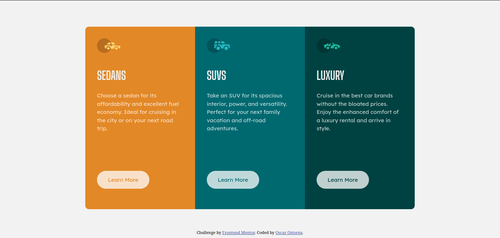

# Frontend Mentor - QR code component solution

This is a solution to the [3-column preview card component challenge on Frontend Mentor](https://www.frontendmentor.io/challenges/3column-preview-card-component-pH92eAR2-). 

## Table of contents

- [Screenshot](#screenshot)
- [Links](#links)
- [Built with](#built-with)
- [Author](#author)

## Screenshot

## Links

- Live Site URL: [Add live site URL here](https://oscarvillalta.github.io/3-Column-FrontEndProject/)

## Built with

- Semantic HTML5 markup
- CSS custom properties
- Flexbox

## Author

- Github - [Oscar Villalata](https://github.com/OscarVillalta)
- Frontend Mentor - [@OscarVillalta](https://www.frontendmentor.io/profile/OscarVillalta)
